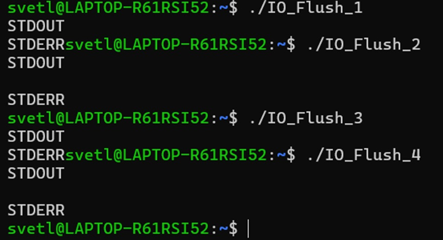
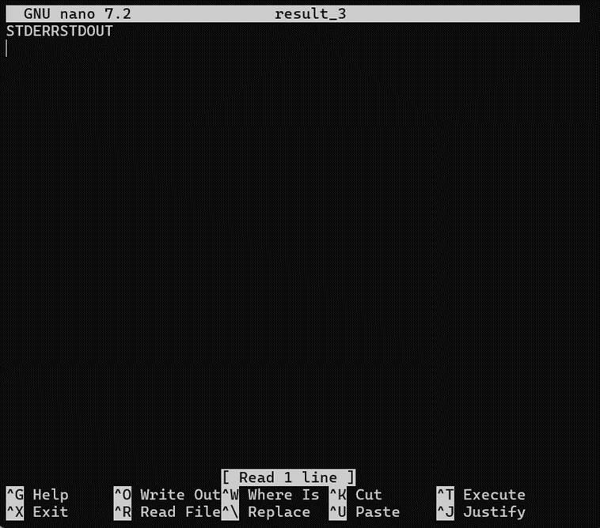
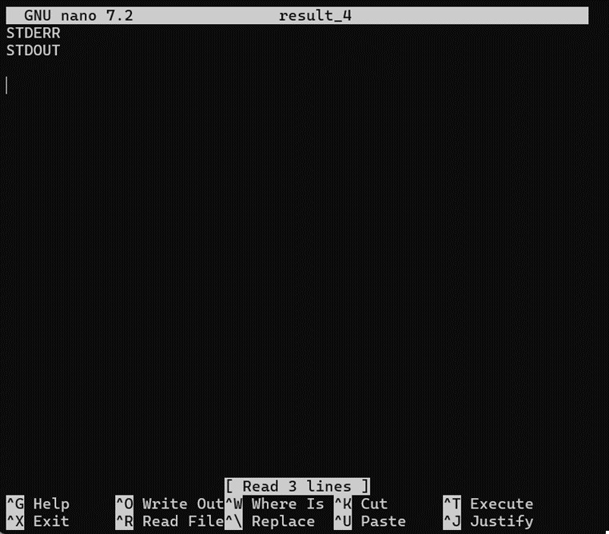

# **IO_Flush**

1. [IO_Flush: эксперимент](#io_flush-эксперимент)
    1) [Описание задания 1](#описание-задания-1)
    2) [Решение задания 1](#решение-задания-1)
    3) [Вывод по заданию 1](#вывод-по-заданию-1)
2. [IO_Flush: автоматизация](#io_flush-автоматизация)
    1) [Описание задания 2](#описание-задания-2)
    2) [Решение задания 2](#решение-задания-2)
    3) [Вывод по заданию 2](#вывод-по-заданию-2)

## IO_Flush: эксперимент
### *Описание задания 1*
Под своей обычной десктопной ОС попробуйте:
1.	Откомпилировать и собрать программу, запустить, как есть.
2.	Добавить символы '\n' в конец строк.
3.	Убрать fflush
4.	Перенаправить вывод (оба потока) в файл.
Сделайте это в разных сочетаниях.
И опишите результат отчёте к данному заданию, не забыв указать,
что у вас за операционная система.

### *Решение задания 1*
Используемые инструменты:
- Используемая ОС – Windows 11.
- В процессе решения было использовано WSL для работы с консолью дистрибутива Ubuntu.

В рамках данного задания было решено выполнить следующие 
сочетания вывода с последующим выполнением вывода в файл:
-	без учёта пунктов 2 и 3 (то есть обычное выполнение пункта 1)
(в данном случае такая компилируемая программа будет называться IO_Flush_1);
-	с учётом пункта 2, но без учёта пункта 3
(в данном случае такая компилируемая программа будет называться IO_Flush_2);
-	с учётом пункта 3, но без учёта пункта 2
(в данном случае такая компилируемая программа будет называться IO_Flush_3);
-	с учётом пунктов 2 и 3
(в данном случае такая компилируемая программа будет называться IO_Flush_4).

Все перечисленные варианты файлов расположены в папке Code_variations.

Ниже приведён результат выполнения каждого из
перечисленных сочетаний по порядку:

<figure>
  
  <figcaption>
  Рисунок 1 -- Результат выполнения сочетаний вывода
  <figcaption>
</figure>

Также необходимо выполнить направление данных выводов в файл.
Но так как используются два потока вывода,
то необходимо использовать символ & перед командой записи >.

Результаты направления вывода программ в файл представлены
ниже c IO_Flush_1 по IO_Flush_4:

<figure>
  
  <figcaption>
  Рисунок 2 -- Результат направления вывода программы IO_Flush_1 в файл
  <figcaption>
</figure>

<figure>
  
  <figcaption>
  Рисунок 3 -- Результат направления вывода программы IO_Flush_2 в файл
  <figcaption>
</figure>

<figure>
  
  <figcaption>
  Рисунок 4 -- Результат направления вывода программы IO_Flush_3 в файл
  <figcaption>
</figure>

<figure>
  
  <figcaption>
  Рисунок 5 -- Результат направления вывода программы IO_Flush_4 в файл
  <figcaption>
</figure>

### *Вывод по заданию 1*
Как можно заметить из результатов вывода в консоль и файл,
разные варианты выполнения вывода выдают разные результаты:
-	Вывод без использования символа “\n” и с использованием fflush
в файл записывается без лишних переносов,
но на консоли последняя строка сливается с приглашением командной строки;
-	Вывод c использованием символов “\n” и fflush
на консоль получается без сливания с приглашением,
но и там, и в файле добавляется пустая строка между элементами вывода;
-	Вывод без использования символа “\n” и fflush
на консоль повторяет результат первого сочетания
(то есть последняя строка сливается с приглашением),
но в случае записи в файл строки сливаются в одну и
меняет порядок элементов местами;
-	Вывод с использованием символа “\n” и без использования fflush
на консоль повторяет второе сочетание
(то есть выводится без сливания с приглашением),
а при записи в файл строки не сливаются и не разделяются пустой строкой,
но в самом конце добавляется ещё 1 пустая строка и их порядок меняется.

## IO_Flush: автоматизация
### *Описание задания 2*
Сделайте для своей программы параметры, которые позволят включать
или выключать опции из предыдущего задания. В любом виде, на ваш вкус.
И сделайте скрипт (сценарий командной оболочки), который бы
собирал вашу программу, и запускал бы её с разными параметрами,
воспроизводя эксперимент из предыдущей задачи.

Программу и сценарий для её сборки и запуска поместите
в каталоге01.IO_flush вашего репозитория.

### *Решение задания 2*
Необходимый сценарий командной оболочки реализован в файле io_flush_code,
который принимает лишь числа от 1 до 4. В самом файле выполняется следующее:
- Проверка передачи параметра;
- Проверка соответствия значения необходимому числовому диапозону;
- Проверку наличия исполняемого файла IO_Flush,
в случае отсутствия которого выполняет его компиляцию;
- Выполняет файл IO_Flush с передачей ему параметра
и перенаправление вывода в файл result.

Файл IO_Flush в записимости от полученного параметра выполняет
один из сценариев вывода. Так при значении 1 выполняется сценарий вывода 1,
при значении 2 - 2, и так далее.

Для корректного выполнения советуется хранить исполняемые файлы в одной папке.
Для того, чтобы файл io_flush_code можно было использовать, потребуется ввести
команду chmod uog+x io_flush_code.

### *Вывод по заданию 2*
В результате выполнения задания были достигнуты следующие цели:
- Создан 1 файл для выполнения всех вариантов вывода по желанию;
-	Скрипт для передачи номера варианта вывода