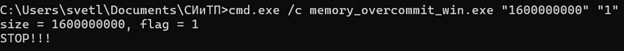

# **Memory_Overcommit**

1. [Описание задания](#описание-задания)
2. [Выполнение задания](#выполнение-задания)
    1) [*Выполнение в среде WSL*](#выполнение-в-среде-wsl)
    2) [*Выполнение в среде Linux*](#выполнение-в-среде-linux)
    3) [*Выполнение в среде Windows*](#выполнение-в-среде-windows)
3. [Выводы по заданию](#выводы-по-заданию)

## Описание задания
1. Выделить заведомо сликом большое количество памяти при помощи `malloc` (предпочтительно) или объявления глобального массива. Количество памяти задать параметром командной строки.
2. С шагом в 4 КиБ (вероятно минимальный размер страницы на вашем компьютере) обращаться к этой памяти на чтение или на запись. Для того, чтобы задать, идёт обращение на чтение или на запись, использовать параметр командной строки.
3. Чтобы процесс был управляемым, раз в неколько тысяч (или десятков, или сотен тысяч, решите сами) обращений делайте паузу на несколько десятков или сотен (тоже решите сами) миллисекунд. Чтобы ОС превращалась в тыкву управлямо.
4. Пронаблюдайте за потреблением памяти при помощи системных инструментов. В каких случаях оно будет расти, в каких — нет.
5. Если у вас есть возможность, попробуйте испытать программу под разными ОС.

## Выполнение задания
### *Выполнение в среде WSL*
В WSL использовалась консоль дистрибутива Ubuntu.

Файл на языке C, который содержит основные операции,
и файл на языке Bash, являющийся посредником между консолью и программой,
хранятся в папке WSL_codes под названием `memory_overcommit_wsl.c`
и `memory_overcommit_code` соответственно. 

В процессе работы с данными файлами было замечено, что
максимально возможный размер массива с данными типа `long long` равен
примерно **512000000** при обращении к записи. Если преодолеть
обозначенный объем памяти, то процесс тут же завершает работут, что
означает, что ОС в тыкву не превратится. При работе в пределах необходимого
объема какие-либо проблемы не замечены.

Ниже приведёны 2 изображения потребления ресурсов: 1 - до выполнения
обращения к записи при размере **512000000**, а другой - в процессе.
Важно отметить, в случае выполнения обращения на чтение потребление
аналогичным образом растет, но программа выполняет её быстрее.

<figure>
  
  <figcaption>
  Рисунок 1 -- Потребление ресурсов до выполнения обращения
   
   
  <figcaption>
</figure>

<figure>
  
  <figcaption>
  Рисунок 2 -- Потребление ресурсов во время выполнения обращения
   
   
  <figcaption>
</figure>

### *Выполнение в среде Linux*

В данном случае подразумевается дистрибутив **Debian 12**, запущенный с 
помощью **Oracle VM VirtualBox**.

Файл на языке C, который содержит основные операции, и файл на языке 
Bash, являющийся посредником между консолью и программой,
хранятся в папке Linux_codes под названием `memory_overcommit_linux.c`
и `memory_overcommit_code` соответственно. 

В данном случае ОС тоже в тыкву не превратится, но благодаря тому, что
процесс становится убитым во время своего выполнения. При работе в
пределах необходимого объема какие-либо проблемы не замечены.

Ниже как раз приведёны 3 изображения работы программы. Причём первые 2
показывают потребление ресурсов до и во время исполнения обращения к записи,
а третий - результат выполнения, на котором заметно убийство процесса.
При выполнении обращения на чтение потребление программа очень быстро заканчивает
свой процесс, не особо сильно потребляя ресурсы.

<figure>
  
  <figcaption>
  Рисунок 3 -- Потребление ресурсов до выполнения программы
   
   
  <figcaption>
</figure>

<figure>
  
  <figcaption>
  Рисунок 4 -- Потребление ресурсов во время выполнения программы
   
   
  <figcaption>
</figure>

<figure>
  
  <figcaption>
  Рисунок 5 -- Результат выполнения программы
   
   
  <figcaption>
</figure>

### *Выполнение в среде Windows*

В данном случае подразумевается конкретно **Windows 11**.

Файл на языке C, который содержит основные операции, и файл на языке Bat,
являющийся посредником между консолью и программой, хранятся в папке
Windows_codes под названием `memory_overcommit_win.c` и
`memory_overcommit_code` соответственно. 

В данном случае ограничения на объем отсутствуют, из-за чего программа 
может потенциально превратиться в тыкву. Порой может доходить до черного
экрана, из-за чего необходимо устройство отключить и снова включить.
Зафикисрованы сулчай, когда другие процессы отключались, например,
браузер и другие приложения.

Важно отметить, в случае выполнения обращения на чтение потребление
аналогичным образом растет, но программа выполняет её быстрее.

Ниже как раз приведёны 3 изображения работы программы. Причём первые 2
показывают потребление ресурсов до и во время исполнения обращения к записи,
а третий - результат выполнения.

<figure>
  
  <figcaption>
  Рисунок 6 -- Потребление ресурсов до выполнения программы
   
   
  <figcaption>
</figure>

<figure>
  
  <figcaption>
  Рисунок 7 -- Потребление ресурсов во время выполнения программы
   
   
  <figcaption>
</figure>

<figure>
  
  <figcaption>
  Рисунок 8 -- Результат выполнения программы
   
   
  <figcaption>
</figure>

## Выводы по заданию
В результат выполнения работы было замечено, что в консолях дистрибутивов
на основе ядра Linux предусмотрены скрипты, предовращающие приостановку работы ОС, 
в то время как в Windows подобное не предусмотрено, из-за чего ОС можно довести до
еле рабочего состояния.

Также обращение на чтение является менее затратным, чем образение на запись.
