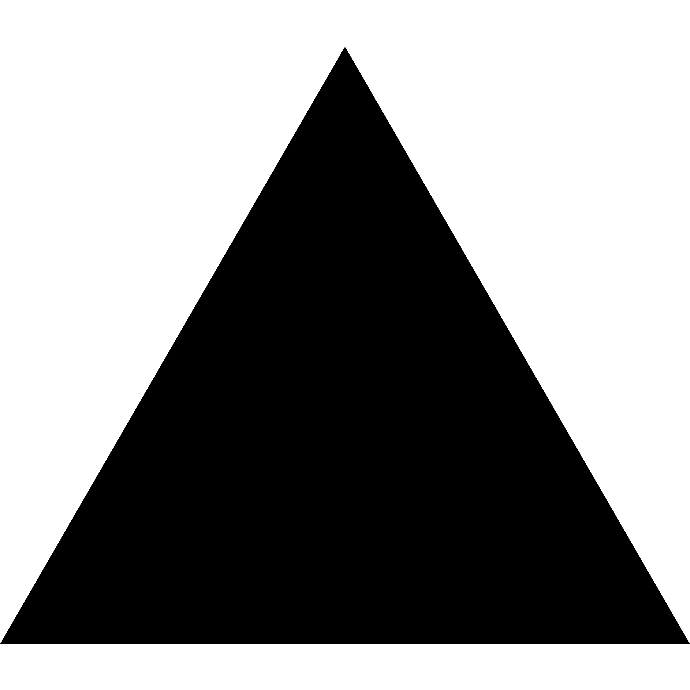
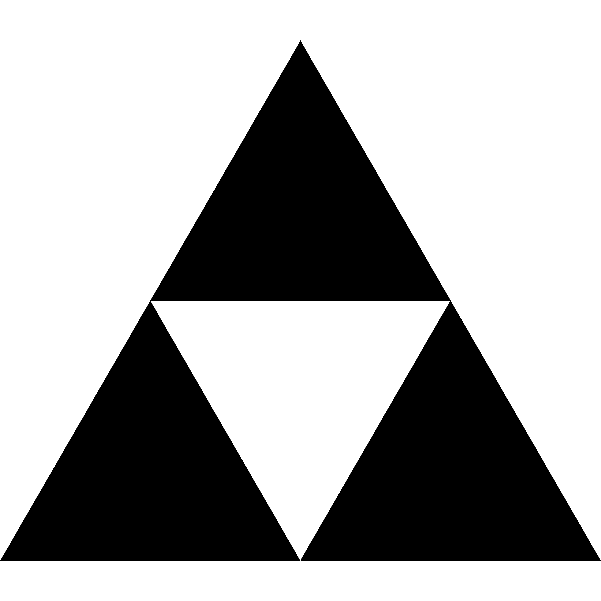
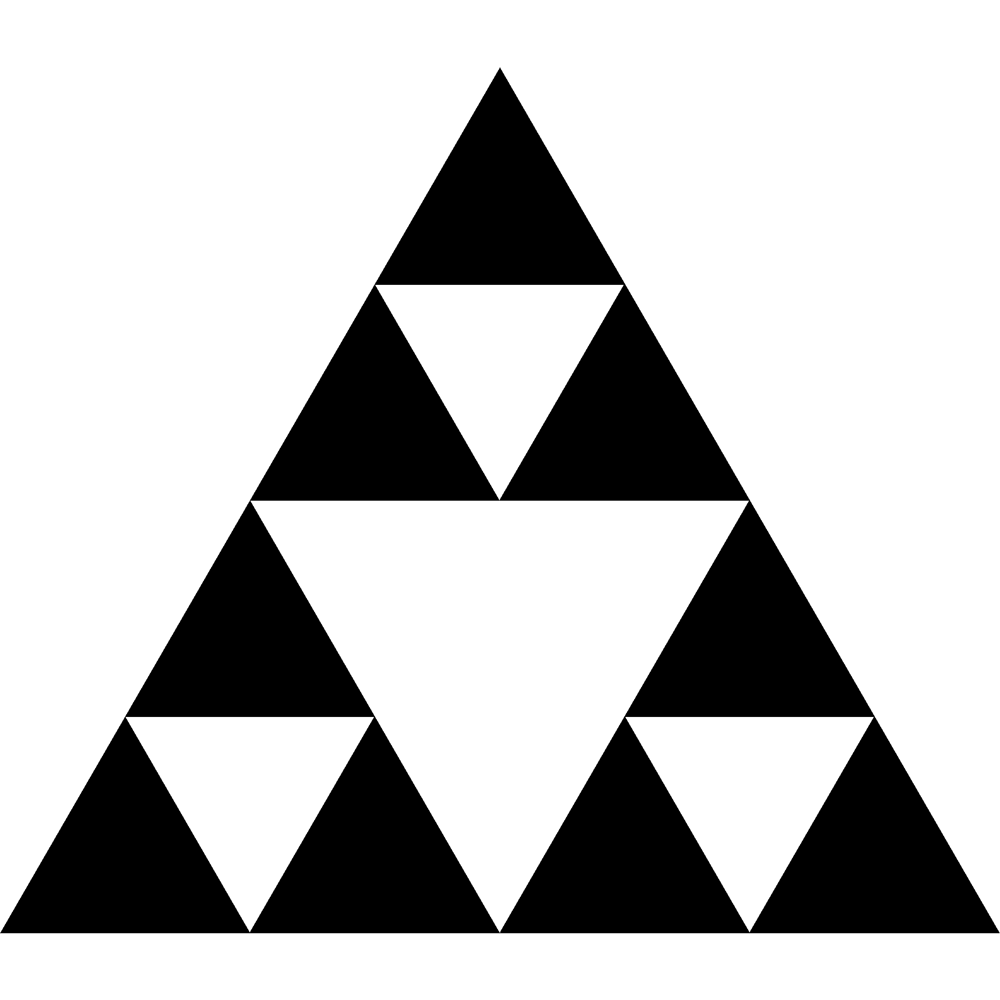
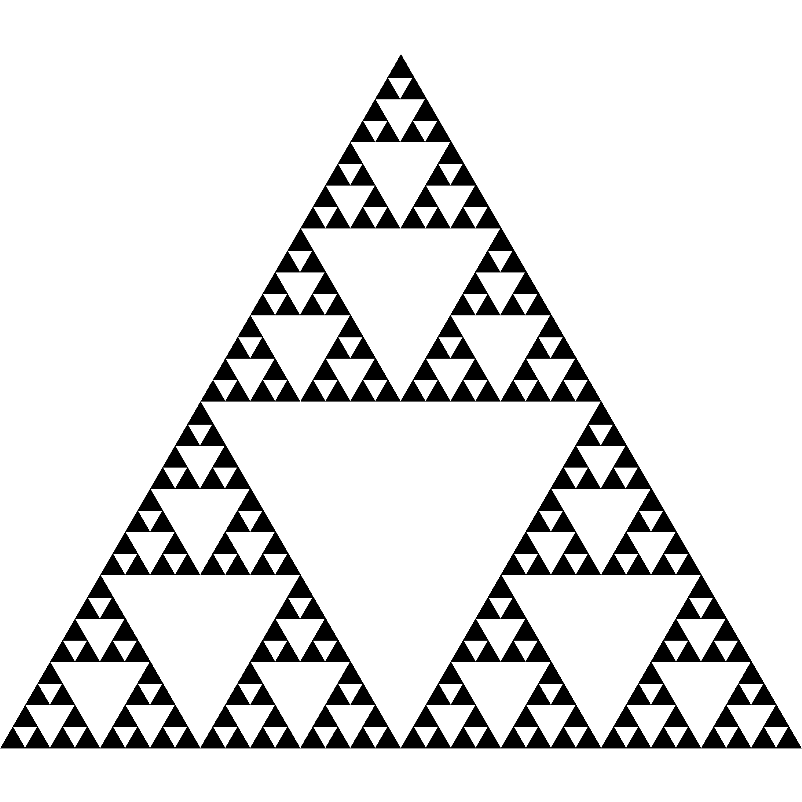

# **Fractal**

1. [Ковёр Серпинского](#ковёр-серпинского)
    1) [Описание ковра Серпинского](#описание-ковра-серпинского)
    2) [Результаты ковра Серпинского](#результаты-выполнения-ковра-серпинского)
2. [Треугольник выполнения Серпинского](#треугольник-серпинского)
    1) [Описание треугольника Серпинского](#описание-треугольника-серпинского)
    2) [Результаты выполнения треугольника Серпинского](#результаты-выполнения-треугольника-серпинского)

## Ковёр Серпинского
### *Описание ковра Серпинского*

Ковер Серпинского – один из самых известных фракталов, который в своей сущности является воплощением концепции самоподобия и бесконечности. Назван в честь польского математика Вацлава Серпинского, который в 1916 году первым описал его свойства.

Он собой плоскость, разделенную на 9 квадратов. Из центрального квадрата удаляется центр и остаются только 8 маленьких квадратов. Процедура повторяется для каждого оставшегося квадрата бесконечное число раз. В результате каждый квадрат делится на 9 равных частей, и таким образом образуется ковер Серпинского.

Ковер Серпинского является примером фрактального самоподобия – его структура повторяется на каждом уровне масштабирования. Если мы даже применим процедуру деления на 9 частей до очень мелкого масштаба, ковер Серпинского все равно сохранит свою структуру – каждая из 8 оставшихся частей будет также состоять из 8 маленьких квадратов.

### *Результаты выполнения ковра Серпинского*

Ниже приведёны ковры для разных уровней от 1 до 7:

<figure>
  
  <figcaption>
  Рисунок 1 -- Ковёр Серпинского уровня 1
   
   
  <figcaption>
</figure>

<figure>
  
  <figcaption>
  Рисунок 2 -- Ковёр Серпинского уровня 2
   
   
  <figcaption>
</figure>

<figure>
  
  <figcaption>
  Рисунок 3 -- Ковёр Серпинского уровня 3
   
   
  <figcaption>
</figure>

<figure>
  
  <figcaption>
  Рисунок 4 -- Ковёр Серпинского уровня 4
   
   
  <figcaption>
</figure>

<figure>
  
  <figcaption>
  Рисунок 5 -- Ковёр Серпинского уровня 5
   
   
  <figcaption>
</figure>

<figure>
  
  <figcaption>
  Рисунок 6 -- Ковёр Серпинского уровня 6
   
   
  <figcaption>
</figure>

<figure>
  
  <figcaption>
  Рисунок 7 -- Ковёр Серпинского уровня 7
   
   
  <figcaption>
</figure>

## Треугольник Серпинского
### *Описание треугольника Серпинского*

Треугольник Серпинского — это фрактал, который получается из треугольника путем рекурсивного деления его на меньшие треугольники. На каждом шаге берется каждый треугольник и заменяется на еще три равносторонних треугольника меньшего размера. Этот процесс повторяется до бесконечности для каждого из меньших треугольников, которые остались.

### *Результаты выполнения треугольника Серпинского*

Ниже приведёны треугольники для разных уровней от 1 до 7:

<figure>
  
  <figcaption>
  Рисунок 8 -- Треугольник Серпинского уровня 1
   
   
  <figcaption>
</figure>

<figure>
  
  <figcaption>
  Рисунок 9 -- Треугольник Серпинского уровня 2
   
   
  <figcaption>
</figure>

<figure>
  
  <figcaption>
  Рисунок 10 -- Треугольник Серпинского уровня 3
   
   
  <figcaption>
</figure>

<figure>
  
  <figcaption>
  Рисунок 11 -- Треугольник Серпинского уровня 4
   
   
  <figcaption>
</figure>

<figure>
  
  <figcaption>
  Рисунок 12 -- Треугольник Серпинского уровня 5
   
   
  <figcaption>
</figure>

<figure>
  
  <figcaption>
  Рисунок 13 -- Треугольник Серпинского уровня 6
   
   
  <figcaption>
</figure>

<figure>
  
  <figcaption>
  Рисунок 14 -- Треугольник Серпинского уровня 7
   
   
  <figcaption>
</figure>